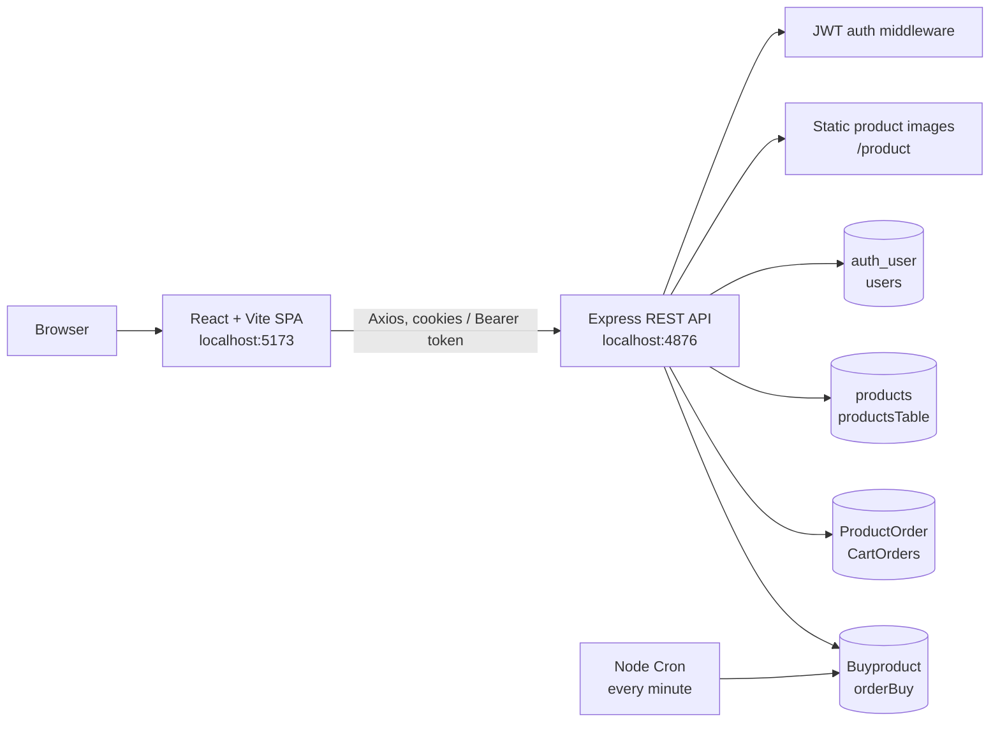

# MCODE E-Commerce — Project Documentation

> **Documentation scope:** source code currently present in this repository.  
> **Last reviewed:** 27 August 2026

## 1. Project overview

MCODE is a full-stack e-commerce web application. Customers can browse products, inspect a product, add it to a cart, submit a delivery and payment order, view their cart/orders, and track an order through delivery stages.

The application is split into a React single-page application (SPA) and a REST API. The API handles user registration, JWT session validation, product/cart/order data, static product images, and automatic order-tracking progression.

### Main capabilities

- Product catalogue with category-based assets.
- Product detail/quantity selection and "Add to Cart" flow.
- Checkout with delivery details and payment-method selection.
- Cart and placed-order views.
- Protected settings/profile page.
- Cookie-based JWT authentication with refresh-token renewal.
- Five-stage order tracker: **Order Placed → Packed → Shipped → Out for Delivery → Delivered**.

## 2. Technology stack

| Layer | Technology |
|---|---|
| Frontend | React 19, Vite 8, React Router 7 |
| UI | Tailwind CSS 4, Lucide icons, Swiper; Three.js/Spline packages are installed |
| Client data | Axios and TanStack React Query |
| Backend | Node.js, Express 5 |
| Authentication | JSON Web Tokens, `bcrypt`, HTTP-only cookies |
| Database | MySQL using `mysql2` |
| Background work | `node-cron` |
| Logging | Morgan |

## 3. High-level architecture



### Request flow

1. React Query components request catalogue, cart, and order data through Axios.
2. Express routes under `/auth` select a controller.
3. Protected routes run `Tokens.js`, which verifies the access token or creates a new access token from a valid refresh token.
4. Controllers query the appropriate MySQL database and return JSON.
5. React Query caches the result; mutations invalidate the relevant cart/order cache.

## 4. Repository structure

```text
Ecommers/
├── frontend/                         # React client
│   ├── src/
│   │   ├── Router/                    # Layout, router, protected route
│   │   ├── components/
│   │   │   ├── Home/                  # Landing page, categories, featured content
│   │   │   ├── Product/               # Product catalogue/cards
│   │   │   ├── ChooseProduct/         # Product detail, cart and buy actions
│   │   │   ├── Orders/                # Cart, checkout, order tracker
│   │   │   ├── login/                 # Account creation interface
│   │   │   └── Setting/               # Protected profile/settings dashboard
│   │   ├── CenterProductData.jsx      # Product React Query hook
│   │   └── main.jsx                   # React Query + router bootstrap
│   └── vite.config.js
├── backend/                          # Express API
│   ├── server.js                      # HTTP server entry point
│   ├── src/
│   │   ├── app.js                     # Middleware and route registration
│   │   ├── config/config.js           # Environment configuration
│   │   ├── db/dataBase.js             # MySQL connections
│   │   ├── router/auth.routes.js      # API endpoints
│   │   ├── controllers/               # Business/data access handlers
│   │   ├── middleware/Tokens.js       # JWT verification/refresh
│   │   ├── cron/orderCron.js          # Order-status scheduler
│   │   └── product/                   # Product image assets/data files
│   └── MySql.md                       # General MySQL notes
└── PROJECT_DOCUMENTATION.md           # This document
```

## 5. Frontend architecture

### Application bootstrap

`src/main.jsx` creates a single `QueryClient`, wraps the application in `QueryClientProvider`, and mounts `RouterProvider`. Vite uses the React and Tailwind plugins.

### Routes

| URL | Component | Purpose | Protection |
|---|---|---|---|
| `/` | `Home` | Landing/home page | Public |
| `/Product` | `Product` | Product catalogue | Public |
| `/ChooseProduct` | `ChooseProduct` | Selected product details | Public |
| `/BuyOrder` | `BuyOrder` | Checkout wizard | Public route; API requires auth |
| `/Order` | `Order` / `PosPage` | Cart/order management view | Public route; API requires auth |
| `/OrderTracker` | `OrderTracker` | Delivery status timeline | Public |
| `/login` | `LoginPage` | Account creation UI | Public |
| `/setting` | `ProtectedRoute` → `Setting` | Profile and settings dashboard | JWT validated |

`Layout.jsx` provides the common header/navigation and shows the cart count. `ProtectedRoute.jsx` calls `/auth/checkAuth` before rendering `Setting`.

### Client-side state

| Storage/mechanism | Data | Purpose |
|---|---|---|
| React Query | `productData` | Product catalogue cache |
| React Query | `cartdata` | Current user cart cache |
| React Query | `Orderdata` | Order list cache |
| `localStorage.chooseProduct` | Selected product and quantity | Passes selection into product/checkout views |
| `localStorage.order` | Selected placed order | Drives order tracker view |
| Cookies | `accesstOKEN`, `refreshToken` | API session tokens |
| `localStorage.authStatus` | Cached UI auth state | Header/protected-route rendering |

## 6. Backend architecture

### Middleware pipeline

The Express app configures the following pipeline:

1. Static product files at `/product` mapped to `src/product`.
2. CORS for `http://localhost:5173` with credentials enabled.
3. Cookie parser.
4. JSON request-body parser.
5. Morgan development logger.
6. `/auth` router.

### Authentication behaviour

- Account creation hashes passwords with bcrypt (10 salt rounds), creates a `users` row, and sends access and refresh JWTs as HTTP-only cookies.
- The access token lasts **2 days**; the refresh token lasts **7 days**.
- Protected endpoints accept `accesstOKEN` from a cookie or a `Bearer` Authorization header.
- If the access token is expired and a refresh token is valid, the middleware looks up the user and issues a replacement access-token cookie.

> There is currently an account-creation endpoint, but no separate password-verification/login endpoint. The frontend label "sign in" invokes account creation.

### Order-status automation

`src/cron/orderCron.js` runs every minute. For each `orderBuy` row whose `orderTrack` is below 5, it increments `orderTrack` by one. This means a new order progresses one tracking stage per minute until delivered.

## 7. API reference

Base URL: `http://localhost:4876`  
All routes below are prefixed with `/auth`.

| Method | Endpoint | Auth | Controller | Function |
|---|---|---:|---|---|
| POST | `/singin` | No | `auth.controller.js` | Creates user and session cookies |
| GET | `/checkAuth` | Yes | `checkAuth.controller.js` | Returns authenticated user |
| GET | `/getProduct` | No | `getproduct.controller.js` | Lists all products |
| POST | `/insert-product` | Yes | `insert.controller.js` | Inserts configured product data |
| POST | `/cartProduct` | Yes | `cartProduct.controller.js` | Adds a product to cart |
| GET | `/getCartProduct` | Yes | `getcarProduct.controller.js` | Lists the current user's cart |
| POST | `/deleteCart` | Yes | `deletcart.controller.js` | Deletes a cart row by `order_id` |
| POST | `/buyorder` | Yes | `buyProduct.controller.js` | Creates a placed order |
| GET | `/getBuyProductdata` | Yes | `getBuyProduct.controller.js` | Lists placed orders |
| POST | `/deleteBuyOrder` | Yes | `deleteOrderProduct.controller.js` | Deletes an order by `order_id` |

### Core request bodies

**Create account — `POST /auth/singin`**

```json
{ "firstName": "Aman", "lastName": "Kumar", "email": "aman@example.com", "password": "secret" }
```

**Add cart product — `POST /auth/cartProduct`**

```json
{ "product_id": 1, "quantity": 2, "product_name": "Product", "product_price": 499, "image": "/product/...", "category": "Footwear" }
```

**Place order — `POST /auth/buyorder`**

```json
{ "username": "Aman Kumar", "product_id": 1, "quantity": 2, "product_name": "Product", "product_price": 499, "catogary": "Footwear", "image": "/product/...", "address_line2": "Street", "city": "Delhi", "state": "Delhi", "payment_method": "cod", "pin_code": "110001", "email_Address": "aman@example.com", "Phone_number": "9999999999" }
```

## 8. Database model

The application connects to four named MySQL databases. Table definitions were not included in the repository, so this table documents fields directly used by the source code.

| Database | Table | Used fields |
|---|---|---|
| `auth_user` | `users` | `id`, `firstName`, `lastName`, `email`, `password` |
| `products` | `productsTable` | `id`, `title`, `name`, `description`, `rating`, `price`, `offer`, `image`, `category`, `brand`, `stock`, `delivery`, `size`, `color` |
| `ProductOrder` | `CartOrders` | `order_id`, `user_id`, `product_id`, `quantity`, `product_name`, `product_price`, `image`, `category` |
| `Buyproduct` | `orderBuy` | `order_id`, `user_id`, `username`, product fields, address fields, payment fields, `orderTrack` |

Relationship intent:

```text
users.id ──< CartOrders.user_id
users.id ──< orderBuy.user_id
productsTable.id ── referenced by CartOrders.product_id / orderBuy.product_id
```

## 9. Local setup and run guide

### Prerequisites

- Node.js and npm.
- MySQL server running locally on port `3306`.
- Databases/tables from the model above (or an SQL schema supplied separately).

### Environment variables

Create `backend/.env`:

```env
PORT=4876
ACCESS_TOKEN=replace_with_a_long_random_access_secret
REFRESH_SECRET=replace_with_a_long_random_refresh_secret
```

### Start the app

Run these in separate terminals:

```powershell
cd D:\code\project\Ecommers\backend
npm install
npm run dev
```

```powershell
cd D:\code\project\Ecommers\frontend
npm install
npm run dev
```

Then open the Vite address shown in the terminal (normally `http://localhost:5173`). Ensure the API listens on port `4876`, because the frontend currently uses this URL directly.

## 10. Security and maintenance notes

- **Move MySQL credentials to `.env`:** `src/db/dataBase.js` contains database credentials in source code. Replace them with environment variables and do not commit `.env`.
- **Add a real login endpoint:** `/auth/singin` only creates users; add email/password verification for returning users.
- **Scope ownership checks:** order deletion and order listing do not visibly filter by `user_id` in their controllers. Ensure users can only read/delete their own orders.
- **Use secure cookies in production:** set `secure: true`, configure production CORS origin, and consider `sameSite: 'none'` only when cross-site cookies are required over HTTPS.
- **Validate request input:** add server-side validation for account, cart and checkout data; avoid trusting product price/image values sent by the client.
- **Centralize API configuration:** replace repeated `http://localhost:4876` strings with an environment-based Axios client (for example `VITE_API_URL`).
- **Add database schema/migrations and tests:** neither is currently present, which makes reliable setup and deployment harder.
- **Review the cron schedule for production:** one status increment per minute is useful for demonstration, but normally delivery updates should come from fulfilment events.

## 11. Current limitations

- API responses and routes include some spelling inconsistencies (`singin`, `catogary`, `accesstOKEN`); preserve them for compatibility or migrate them versionedly.
- The product-insertion controller imports a configuration object as though it were product data; this should be reviewed before using `/insert-product`.
- Cart products accept `total_price` from the frontend but the active insert query does not store it.
- The existing frontend README is still the default Vite template; this document is the project-specific reference.
